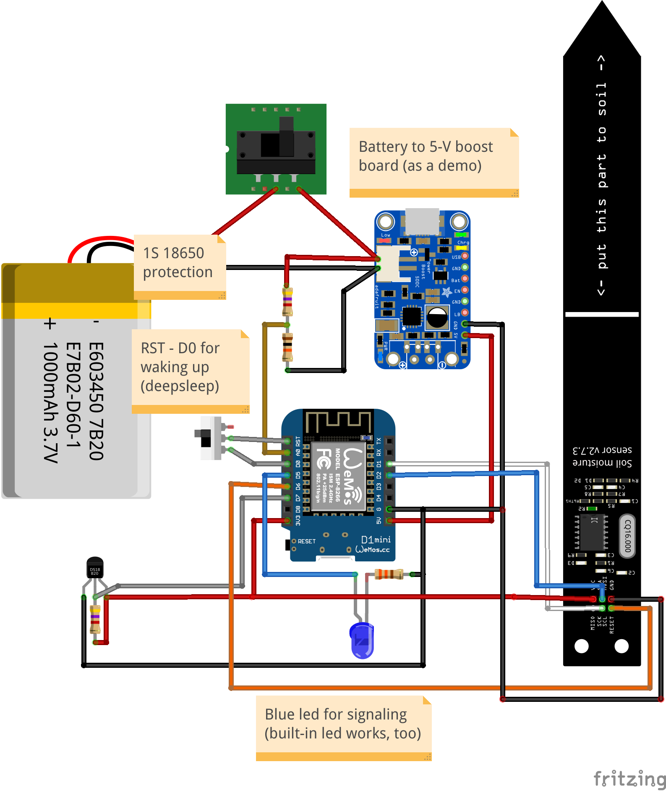
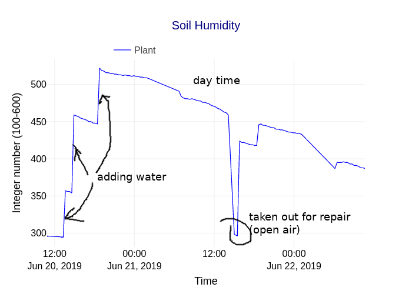

# watering-plant
- Use a capacitance soil humididity sensor
- Data is transmited to MQTT server using ESP8266 board
- An ESP8266-01 with NeoPixel subscrbes to the topic and display the color for humidity
monitor humidity content in soil by a capacitance sensor, a subscribe with an LED indicator

# Wiring
- Wiring diagram

  

- Reading in dry and wet soil

  

# Tutorials
- A write-up with more information is on [b-io.info]()
